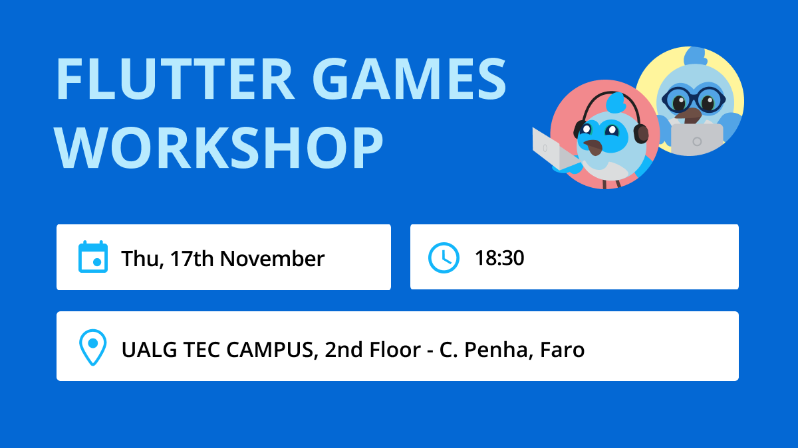

author: danidroid
summary:
id: codelab-dordle-game
tags:
categories:
environments: Web
status: Published
feedback link: https://github.com/danidroid/solace-dev-codelabs/blob/master/markdown/codelab-dordle-game

# Flutter Games Workshop - FlutterFaro #2 - Dordle Game Code Lab

## What you'll learn: Overview

Duration: 0:05:00

Flutter-Faro is part of the Flutter Meetup Network and is bringing some events to the local community related, you guess, with Flutter !! :) Join us!

### Doordle Game - a Wordle game alternative



## What you need: Prerequisites

Duration: 0:07:00

# ⚠️ Required materials

Computer with internet access :) The course will run on all of the latest versions of the popular browsers. For the best experience, the laptop should have Flutter installed on it prior to starting the study jam to save time. Windows/Linux/Mac would all be fine.

Check out: [Setup Flutter](https://flutter.dev/docs/get-started/install)
After you should be able to run `flutter doctor` without any errors.

A device to connect to the laptop (iOS or Android ) OR an Emulator (iOS or Android)
[Android Studio](https://developer.android.com/studio) or [VS Code](https://code.visualstudio.com/) installed with Dart and Flutter Plugins

### lets start :D


## Step 1 - main.dart

Lets start by creating a new demo project, edit the `main.dart` file:

```dart
void main() {
  runApp(const MyApp());
}
```

```dart
class MyApp extends StatelessWidget {
  const MyApp({Key? key}) : super(key: key);

  @override
  Widget build(BuildContext context) {
    return MaterialApp(
      debugShowCheckedModeBanner: false,
      title: 'Dordle Game',
      theme: ThemeData(
        primarySwatch: Colors.blue,
      ),
      scaffoldMessengerKey: scaffoldMessengerKey,
      home: const GamePage(),
    );
  }
}
```

## Step 2 - Game Page

So now its time to start building the game page, lets start by creating a new [StatefulWidget](https://api.flutter.dev/flutter/widgets/StatefulWidget-class.html)

```dart
class GamePage extends StatefulWidget {
  const GamePage({super.key});

  @override
  State<GamePage> createState() => _GamePageState();
}
```

```dart
class _GamePageState extends State<GamePage> {
  
  @override
  Widget build(BuildContext context) {
    // TODO: implement build
    throw UnimplementedError();
  }
}
```

Will see that this will throw an error, keep calm, will fix that shortly...

## Step 3 - Game UI

So, now that we have a red screen in our simulator, lets fix that, by changing the 

```dart
...
  @override
  Widget build(BuildContext context) {
    return Scaffold(
      backgroundColor: Colors.black,
      body: SafeArea(
        bottom: false,
        child: Flex(
          mainAxisAlignment: MainAxisAlignment.spaceBetween,
          direction: Axis.vertical,
          children: [],
        ),
      ),
    );
}
...
```

Saving it, will get rid of the red error, but now is plain black!!!

Lets fix it again, lets create the `GameGridView` widget and add it to the `Flex` widget children:

```dart
...
Flex(
    ...
    children: [
        GameGridView()
    ],
)
...
```

## Step 4 - Game UI - GameGridView

Now will start by creating the `GameGridView` widget:

Can create this in the same file

```dart
class GameGridView extends StatelessWidget {
  const GameGridView({super.key});

  @override
  Widget build(BuildContext context) {
    return Expanded(
      flex: 2,
      child: Container(
        padding: const EdgeInsets.symmetric(horizontal: 16, vertical: 16),
        child: GridView.builder(
            physics: const NeverScrollableScrollPhysics(),
            itemCount: 25,
            gridDelegate: const SliverGridDelegateWithFixedCrossAxisCount(
                mainAxisSpacing: 0.1,
                crossAxisSpacing: 0.1,
                childAspectRatio: 1.0,
                crossAxisCount: 5),
            itemBuilder: (BuildContext context, int index) {
              return Container();
            }),
      ),
    );
  }
}
```

hmm, no changes right? same black plain screen, so much code and no changes!!!

Lets update create a new `GameGridBoxView` widget:

```dart
class GameGridBoxView extends StatelessWidget {
  const GameGridBoxView({
    Key? key,
  }) : super(key: key);

  @override
  Widget build(BuildContext context) {
    return Container(
      width: 40,
      height: 40,
      margin: const EdgeInsets.all(8),
      alignment: Alignment.center,
      decoration: const BoxDecoration(
        color: Color(0xff858b8b),
        borderRadius: BorderRadius.all(
          Radius.circular(8.0),
        ),
      ),
      child: const Text(""),
    );
  }
}
```

hmm still nothing?? can you figure out what is missing?

## Step 4 - Game UI - GameGridView

Correct!!! will need to change this line in the `GridView.builder`:

```dart
    itemBuilder: (BuildContext context, int index) {
        return Container();
    }),     
```

Replace the `Container()` with `GameGridBoxView()`

Finally we started to see something!!!

You can tweak the numbers on the grid to experiment, dont forget to hot-reload to see the changes.

Ok you got so far, but stil there are much to do.

## Step 5 - Keyboard

Now that we have the game grid widget in place, lets focus on the Keyboard.

Go to your `pubspec.yaml` and add to the `dependencies` the following keyboard package:

```yaml
virtual_keyboard_multi_language:
    git:
      url: git://github.com/hassaanalansary/virtual_keyboard_multi_language.git
      ref: master
```

Run the `pub get` to update the project. This will fetch the required package to have 
a virtual keyboard to capture the characters.

Now lets build the keyboad widget:

```dart
Flexible(
  child: Container(
    padding: const EdgeInsets.only(bottom: 32),
    child: VirtualKeyboard(
      height: 200,
      textColor: Colors.white,
      fontSize: 18,
      type: VirtualKeyboardType.Alphanumeric,
      alwaysCaps: true,
    ),
  ),
)
```

Hmm it feels that is missing something, right?

Q: How can we capture the key events??

## Step 6 - Listen to Keyboard

Lets start by adding an Event Listener, so in the `VirtualKeyboard` widget,
add the `postKeyPress` event listener.

```dart
...
VirtualKeyboard(
  ...
  postKeyPress: (key) {}
  ...
...
```

This will capture all the clicked keyboard keys.

Ok, so far we have the Grid view, Keyboard and the event to listen, 
but how we can fill the squares with the clicked keys?

Lets start by an example:

Create a `index` and a `Map` that will hold our key and position, like this:

```dart
int index = 0;
Map<int, String> words = {};
```

Add to the current file.

## Step 7 - Game logic example

Now we'll do some game logic,

Then on the `postKeyPress` event listener lets try by doing this:

```dart
...
VirtualKeyboard(
  ...
  postKeyPress: (key) {
    words[index] = key.text;
  }
  ...
...
```

Now will need to change the `GameGridView` widget and the `GameGridBoxView` widget to pass as the arguments the `index` and the `Map`

```dart
class GameGridView extends StatelessWidget {
  const GameGridView({
    super.key
    this.index,
    this.words
  });

  @override
  Widget build(BuildContext context) {
    ...
    itemBuilder: (BuildContext context, int index) {
        return GameGridBoxView(index: index, words: words);
    }),
    ...
  }
  ...
```

```dart
class GameGridBoxView extends StatelessWidget {
  const GameGridBoxView({
    Key? key,
    this.index,
    this.words
  }) : super(key: key);

  final int index;
  final Map<int, String> words;

  @override
  Widget build(BuildContext context) {
    ...
    child: Text(words[index]?.toUpperCase() ?? ""),
    ...
  }
....
```

Any errors? do you see something?

## Step 8

Ok lets find out what is still missing,

Tip: how can we change the state?

## Takeaways

Duration: 0:07:00

✅ < Fill IN TAKEAWAY 1>   
✅ < Fill IN TAKEAWAY 2>   
✅ < Fill IN TAKEAWAY 3>   


Thanks for participating in this codelab! Let us know what you thought in the [Solace Community Forum](https://solace.community/)! If you found any issues along the way we'd appreciate it if you'd raise them by clicking the Report a mistake button at the bottom left of this codelab.
